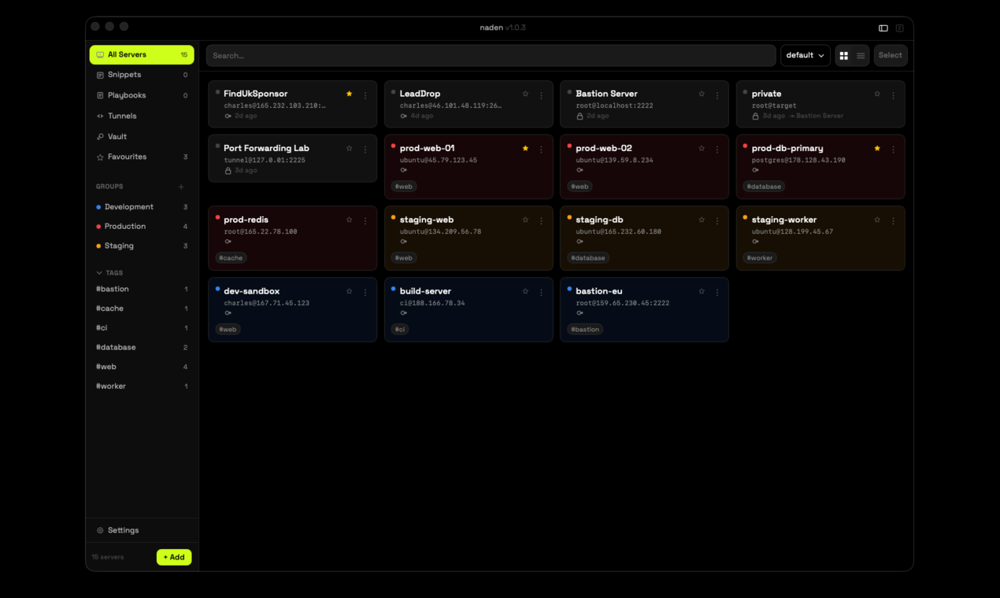

# naden

A fast, secure desktop application for managing SSH connections. Built for engineers who manage many servers and need an organised, keyboard-driven workflow without scattered config files or plaintext credentials.



## Features

- **Server inventory** — add, edit, and organise servers with display name, hostname/IP, port, username, tags, and groups
- **One-click connect** — launch sessions in the built-in terminal or your system terminal
- **Built-in terminal** — multi-tab terminal emulator (up to 20 concurrent sessions) with drag-to-reorder tabs, per-server colour themes, copy-on-select, and in-pane search
- **SFTP browser** — dual-pane file manager with drag-and-drop from Finder, in-place editing with auto-upload on save, batch transfers, and cross-session copy
- **Credential vault** — AES-256-GCM encrypted local storage for SSH passwords and key passphrases, derived via PBKDF2 at 600 000 rounds; unlocked via master password or skipped with a per-device random key
- **SSH key vault** — central registry for private keys; register existing keys, generate Ed25519/RSA/ECDSA in-app, auto-detect type and fingerprint, pick from the server form
- **Jump host support** — define bastion/proxy-jump chains (A → B → C) that resolve automatically on connect; wired automatically when importing from `~/.ssh/config`
- **Port forwarding** — manage local, remote, and dynamic (SOCKS5) SSH tunnels per server; auto-start on connect, start/stop individually with live status
- **Command snippets** — save and insert reusable shell commands into the active terminal from the `⌘S` panel
- **Command palette** — `⌘K` fuzzy-search across servers, active sessions, snippets, and playbooks; results in under 100 ms
- **Fuzzy search** — real-time search across server name, hostname, IP, username, tags, and groups
- **SSH config import** — parse `~/.ssh/config`, preview hosts, and import with ProxyJump relationships resolved
- **Host discovery** — scan the local network for open SSH ports or import from `~/.ssh/known_hosts` without typing hostnames by hand
- **Health monitoring** — live CPU, memory, and disk stats polled from connected servers and shown inline on each server card
- **Connection hooks** — per-server pre-connect and post-disconnect shell scripts; a non-zero pre-connect exit cancels the connection
- **Session settings** — per-server initial working directory and environment variables exported on connect
- **Session recordings** — record terminal output to a plain-text file; view, open in Finder, or delete from the Recordings panel
- **Audit log** — local log of every connection attempt with timestamp, host, username, duration, and outcome; exportable to CSV
- **System tray** — quick-connect to any server or open an SFTP session directly from the menu bar
- **Wake reconnect** — automatically reconnects sessions and tunnels that drop when the machine sleeps
- **Broadcast** — fan out terminal input to multiple sessions at once, with a confirmation guard for destructive commands; named, saved broadcast groups
- **Playbooks** — save multi-step command sequences with per-step delays and `{{host}}`/`{{username}}`/`{{port}}` variable substitution; run from the session toolbar with live step progress
- **AI assistant** — bring-your-own-key chat panel (Anthropic, OpenAI, Gemini, or OpenRouter) with optional live terminal context per message; off by default, keys stored in the encrypted vault
- **Local terminal** — open a local shell session inside the app without a remote connection

## Tech Stack

| Layer | Technology |
|---|---|
| Desktop framework | [Tauri v2](https://tauri.app/) |
| Frontend | React 18 + TypeScript + Tailwind CSS v4 |
| State management | Zustand |
| Terminal emulator | xterm.js + xterm-addon-fit |
| Backend | Rust |
| SSH | `ssh2` crate (libssh2 + vendored OpenSSL) |
| Credential vault | `aes-gcm` (AES-256-GCM), key derived via `pbkdf2`/`sha2` from the master password |
| Fuzzy search | `nucleo` crate |
| SSH config parsing | `ssh2-config` crate |
| Local database | SQLite via `sqlx` |

## Prerequisites

- [Rust toolchain](https://rustup.rs/) (see `rust-version` in `src-tauri/Cargo.toml`)
- Node.js ≥ 20 and npm
- macOS: Xcode Command Line Tools (`xcode-select --install`)

## Getting Started

```bash
# Install frontend dependencies
npm install

# Start the dev build (Vite + Rust hot-reload)
npm run tauri dev
```

## Building for Production

```bash
npm run tauri build
```

This compiles the Rust backend, bundles the React frontend, and produces a platform-native installer in `src-tauri/target/release/bundle/`.

## Development Commands

### Frontend

```bash
npm run dev          # Vite dev server (UI only, no Rust backend)
npm run build        # Bundle frontend to dist/
npm run typecheck    # tsc --noEmit
npm test             # Vitest (run once)
npm run test:watch   # Vitest (watch mode)
```

### Rust backend

```bash
cargo check                   # Fast type-check (no binary output)
cargo clippy -- -D warnings   # Linter
cargo fmt --check             # Format check
cargo test                    # All unit tests
```

Run these from the `src-tauri/` directory, or prefix with `cargo -C src-tauri`.

## Project Structure

```
src/
  components/
    layout/       # AppShell, Sidebar, TopBar, tab bar, vault countdown, session recording button
    servers/      # Server list, card, row, form, bulk actions, port forwards section, host discovery, health stats
    terminal/     # Terminal pane and tab management, broadcast grid, playbook run bar, AI assistant panel, tunnel picker
    sftp/         # SFTP browser, file list, toolbar, chmod dialog
    tunnels/      # Port forward management panel
    keys/         # SSH key vault view
    snippets/     # Command snippet list and form
    playbooks/    # Playbook list and editor
    vault/        # Lock screen and setup modal
    settings/     # Settings modal
    log/          # Audit log view, session recordings view
    onboarding/   # First-run wizard
    shared/       # Error boundary, connection overlay, shared inputs
  hooks/          # useAppInit, useKeyboardShortcuts, useVaultHeartbeat, and other lifecycle hooks
  store/          # Zustand stores (server, terminal, sftp, tunnel, snippet, playbook, broadcast, assistant, ui, vault)
  lib/            # Tauri command wrappers, session buffer, vault activity, clipboard clear
  types/          # Shared TypeScript types

src-tauri/src/
  commands/       # Tauri command handlers (ssh, sftp, vault, server, settings, log, tunnel, snippet, assistant, health, discovery, backup)
  ssh/            # Connection manager, jump host tunnelling, SSH config parser, launcher
  sftp/           # SFTP session manager
  tunnel/         # Local, remote, and dynamic port-forward engine
  vault/          # AES-256-GCM credential vault, master password
  assistant/      # AI provider backends (Anthropic, OpenAI, OpenRouter)
  discovery/      # LAN scanner and known_hosts importer
  db/             # SQLite queries and migrations
  search/         # nucleo-based fuzzy search
  platform/       # macOS-specific native integrations (CLI install, tray, power)
  models/         # Shared data models
```

## Keyboard Shortcuts

| Shortcut | Action |
|---|---|
| `⌘K` | Command palette — search servers, sessions, snippets, playbooks |
| `⌘N` | Add new server |
| `⌘,` | Open settings |
| `⌘F` | Find in terminal |
| `⌘T` | New terminal tab |
| `⌘W` | Close active tab |
| `⌘S` | Open snippet panel |
| `⌘↑` | Navigate to parent directory (SFTP) |

## Security Notes

- Credentials (SSH passwords, key passphrases) are stored AES-256-GCM encrypted in the local SQLite database, keyed by a PBKDF2-HMAC-SHA256-derived master password at 600 000 rounds
- Alternatively, the master password can be skipped — a random per-device key is generated and used instead; credentials remain encrypted at rest
- The vault locks automatically after a configurable idle timeout; brute-force lockout applies after 5 failed unlock attempts (exponential backoff, up to 1 hour)
- AI assistant API keys are stored in the same AES-256-GCM encrypted vault as SSH credentials, not the OS keychain
- No credentials or session data are ever synced or uploaded
